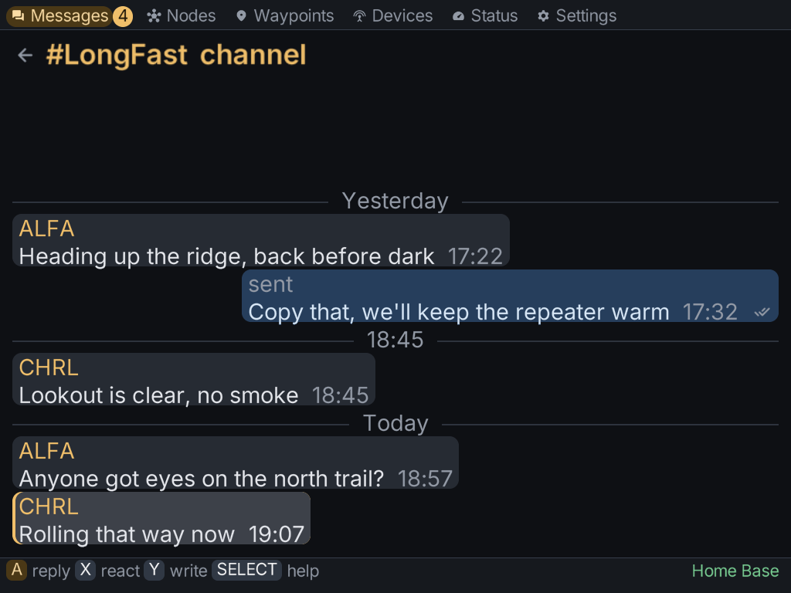
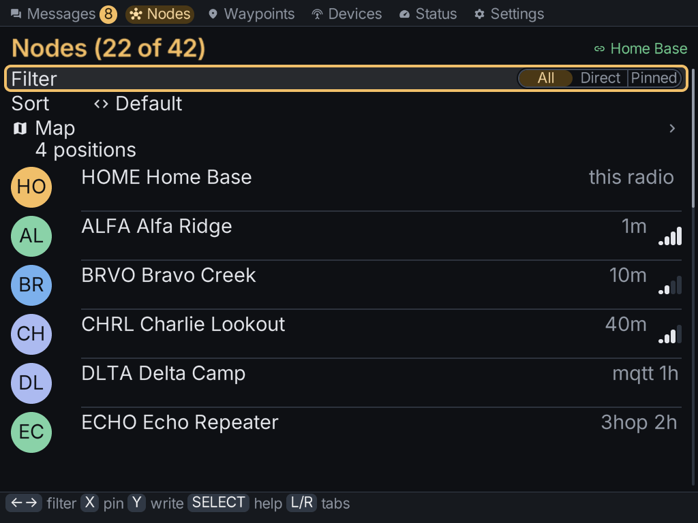
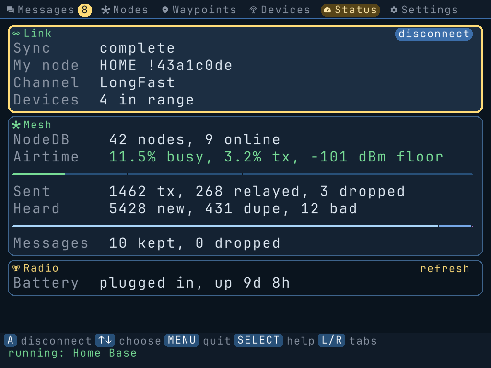
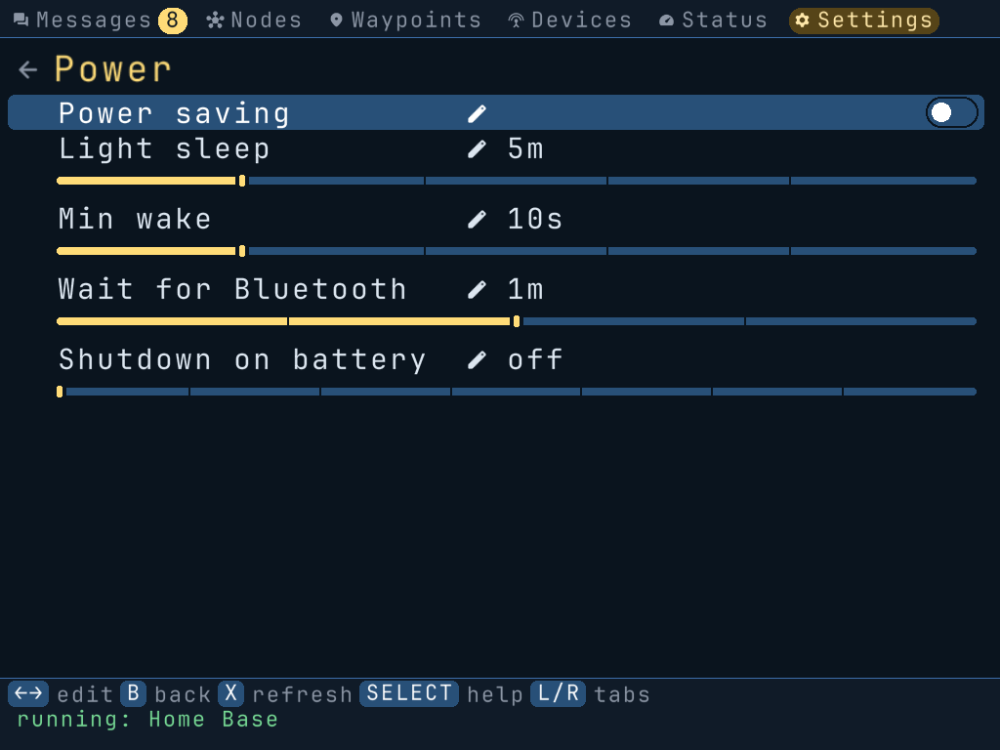

# MeshClient

A Meshtastic client for the TrimUI Brick and other NextUI/MinUI handhelds. Read and send
messages, browse the mesh, and edit your radio's settings over Bluetooth LE or USB — no phone
needed.

Small C core, pluggable transports, ships as a sideloadable `MeshClient.pak`.

<p align="center">
  
  
  
  
</p>

## Install on a Brick

The easiest route is **Tools → Pak Store → MeshClient** on the device.

To install a release by hand, download `MeshClient.pak.zip` and unzip it *into* a folder you
make — the zip holds the pak's contents, not the pak folder, because that is what the Pak Store
expects:

```bash
mkdir -p /Volumes/SDCARD/Tools/tg5040/MeshClient.pak
unzip MeshClient.pak.zip -d /Volumes/SDCARD/Tools/tg5040/MeshClient.pak
```

Unzipping it without making that folder first gives you
`MeshClient.pak/MeshClient.pak/launch.sh`, which the launcher will not run. Copying the
already-unpacked `dist/MeshClient.pak/` folder to `Tools/tg5040/` works too.

The app then appears under **Tools** in the NextUI Launcher. Logs go to
`/.userdata/tg5040/logs/MeshClient.txt`. Once it is installed, Settings → About updates it in
place.

## Using it

Five tabs — Messages, Nodes, Devices, Status, Settings — driven by the d-pad and face buttons.
Connect from **Devices** (it bonds and prompts for a PIN-mode node's six digits), or let
auto-connect find your usual radio on its own.

There is a full CLI too, useful on a desktop and for scripting:

```bash
meshclient --list-devices                                    # nearby nodes and USB ports
meshclient --status --json                                   # handshake summary
meshclient --send-text "on my way" --dest '!433d1a2c' --ack  # direct message, wait for the ack
```

Controls, flags and environment variables are in [`docs/cli.md`](docs/cli.md).

## Building

The core is Linux-only (`epoll`/`timerfd`/`eventfd`). On a Linux host:

```bash
git submodule update --init --recursive   # nanopb, Meshtastic protobufs, NextUI
make setup                                # libdbus-1-dev + the Python protobuf packages
make debug                                # needs CMake >= 3.18 and a C17 toolchain
make test
```

On macOS, or any host with Docker, use the container targets — they bind-mount the repo and build
into `build/linux/`:

```bash
make docker-test     # debug build + unit tests (image built on first use)
make docker-shell    # bash inside the container
make docker-pak      # static aarch64 build -> dist/MeshClient.pak.zip (+ .sha256)
```

`make help` lists the rest. Sanitizers: `make debug CMAKE_ARGS="-- -DMESHCLIENT_ENABLE_ASAN=ON"`
(or `UBSAN`). `make format` runs clang-format over the tree.

### Deploying to a device

With the Brick on WiFi and the SSH Server pak installed, skip the SD card: set `BRICK_HOST` in
`.brick.env` (copy `.brick.env.example`), then `make brick` (build + push), `make deploy`,
`make deploy-logs`, `make deploy-check`, and `make deploy-shot` (a PNG of the device's screen).
One-time setup and troubleshooting are in [`docs/device.md`](docs/device.md).

## Repository layout

| Path | Contents |
|---|---|
| `src/` | core, event loop, transports, UI, utilities |
| `include/` | public headers consumed by transports and tests |
| `tests/` | unit tests, one binary run via CTest |
| `scripts/` | build/package automation, `docker.sh`, `cross-build.sh`, device deploy |
| `docker/` | `Dockerfile` (`dev` and `cross` stages) and the cross toolchain bootstrap |
| `Tools/tg5040/MeshClient.pak/` | pak scaffold: `launch.sh`, CA bundle, platform binaries |
| `proto/meshtastic/`, `third_party/` | upstream protobufs, nanopb and NextUI (submodules) |
| `docs/` | architecture, transports, UI, CLI, device and release documentation |

## Documentation

- [`docs/architecture.md`](docs/architecture.md) — how the client is put together and why
- [`docs/transport.md`](docs/transport.md) — BLE and USB serial, including the Brick's USB quirks
- [`docs/ui.md`](docs/ui.md) — UI store, navigation model, framebuffer rendering
- [`docs/cli.md`](docs/cli.md) — flags, environment variables, on-device controls
- [`docs/device.md`](docs/device.md) — Brick setup and the deploy loop
- [`docs/settings-roadmap.md`](docs/settings-roadmap.md) — radio settings, phase by phase
- [`docs/testing.md`](docs/testing.md) — test categories and filtering
- [`docs/semantic-release.md`](docs/semantic-release.md) — commit conventions and releases

## Packaging notes

`pak.json` at the repo root is the [NextUI Pak Store](https://github.com/LoveRetro/nextui-pak-store)
listing. Its `version` must match the release tag, so `scripts/release-build.sh` stamps it and
`@semantic-release/git` commits it — **do not bump it by hand**. The same step regenerates the
`changelog` entry for the release from its commit subjects (`scripts/pak-changelog.py`), so that
is not hand-maintained either. Its `screenshots` are real captures off a Brick's framebuffer
(`make deploy-shot`).

The pak ships Mozilla's CA roots at `certs/certificates.crt`, from
[curl.se/ca](https://curl.se/ca/cacert.pem). The Brick has no system CA store, so without it the
in-app updater cannot verify github.com. Refresh it by re-downloading that file into
`Tools/tg5040/MeshClient.pak/certs/certificates.crt` and committing the result. It is not
delivered by self-update, so a client installed before it existed needs one pak reinstall.

## Contributing

Follow [`AGENTS.md`](AGENTS.md) for code style, testing and pull request expectations. Commits
follow [Conventional Commits](https://www.conventionalcommits.org/) — see
[`docs/semantic-release.md`](docs/semantic-release.md).

## License

Released under the terms of the license in [`LICENSE`](LICENSE).
