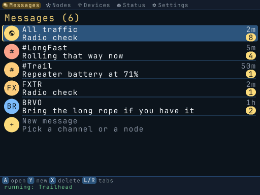

# Client performance

The client keeps UI input responsive during a NodeDB sync and avoids repeating work when the
radio data or rendered pixels have not changed.

- **BLE reads:** `mesh_bluez_client_read()` returns `-EAGAIN` while a `ReadValue` request is
  pending. A reply or the three-second timer wakes the drain through its eventfd. Only one
  read is outstanding; packets retain FIFO order, failures retain exponential backoff, and
  disconnect cancels the read. Late replies cannot complete a newer request. `WriteValue`, `ServicesResolved` and `Connected` also use queued requests: a pending write
  retains the outbound queue head until the reply arrives, with a three-second deadline.
  Property queries have a one-second deadline and independent request slots. Replies wake the
  transport through its eventfd; timeout, cancellation and link reset discard their serials.
  Discovery, subscription, disconnect and agent-management operations still use synchronous calls.
- **Publication:** exact source comparisons skip unchanged roster ranking, message formatting
  and merging, and radio-settings conversion. Message changes, renamed nodes, preferences,
  locale, restored history and roster ownership invalidate the relevant cached view. Dynamic
  status, notices, timers and client settings are still published. This uses comparisons rather
  than revision counters so existing in-place mutation paths remain valid.
- **Persistence:** background roster, message and read-marker changes share a fixed two-second
  save window. Further changes do not move the deadline, so sustained traffic still reaches
  disk. Failed writes stay dirty and retry in another window; orderly shutdown flushes the
  current store. Explicit conversation deletion still persists immediately. An abrupt power
  loss can lose the pending batch.
- **Transcript:** a bounded cache retains formatted ordinary/first-visible rows and measured
  heights. Navigation reuses them, including reaction metadata. Exact message contents,
  filtered indices, conversation context, theme, scale, columns, locale and local calendar/zone
  invalidate it. Allocation failure uses the original layout path.
- **Animation:** the controller retains its latest snapshot. Timer frames consume any pending
  real update, then reuse that snapshot without requesting a synthetic full-store refresh.
- **Text:** a four-way cache retains up to 256 scaled glyph coverage maps. Its key is the
  immutable font descriptor, codepoint and scale; coverage is tinted at draw time, so changing
  colors does not require regenerating it. Oversized glyphs and allocation failure use the
  uncached renderer. Storage is approximately 518 KiB per renderer.
- **Display writes:** the device renders into ordinary RAM, compares against the previous RAM
  frame, and copies changed row spans to page 0 and its page 1 mirror. The first frame fills
  both pages. This preserves the launcher workaround without reading display memory. Two
  1024×768×4 buffers cost 6 MiB; allocation failure keeps the original direct-render path.
  For unchanged snapshots, subsequent animation frames clip drawing to the union of switch,
  meter and snackbar bounds, and skip comparing unaffected rows. Composition still runs in
  normal order to restore overlapping content; layout is not a retained widget tree. Any
  snapshot, theme, scale, geometry, locale or wall-clock-second change requests a full render.
  Allocation failure and the direct-display fallback use full rendering.

## Measurement

Run the text workload in an optimized Linux build (use Docker on macOS):

```sh
./scripts/docker.sh make release
./scripts/docker.sh build/linux/release/devtools/meshclient_perf
```

The benchmark draws 18 rows of repeated text at 1024×768, compares the same rasterizer with
its glyph cache disabled and warm, and checks that the resulting pixels match. One ARM64
Docker run measured **1.972 ms/frame uncached and 0.776 ms/frame cached (2.54×)**. This is a
CPU workload measurement, not a device frame-rate or battery-life measurement.

A subsequent ARM64 Docker run measured the additional workloads below (300 frames each,
1024×768). The reference disables transcript caching and partial drawing but keeps the same
cached glyph rasterizer. These are CPU timings, not measured device frame rates or battery life.

| Workload | Reference | Optimized | Ratio |
| --- | ---: | ---: | ---: |
| Navigate a 64-message transcript | 0.814 ms/frame | 0.732 ms/frame | 1.11× |
| Animate a snackbar over that transcript | 0.826 ms/frame | 0.458 ms/frame | 1.81× |

Use a separate native build root if the normal release tree contains a cross-compiler cache:

```sh
./scripts/docker.sh make release BUILD_ROOT=build/perf-native
./scripts/docker.sh build/perf-native/release/devtools/meshclient_perf
```

All **737 frames across 26 capture scenes** matched the full-render reference byte-for-byte
with a fixed wall clock. `meshclient_uicap --reference` disables the transcript cache and partial
redraws for comparisons; pass the same scene and pinned wall clock to both runs. The unit suite
also compares clipped animation frames through arrival, dismissal, screen and scale changes,
and compares transcript rendering after edits, reactions, delivery changes and locale changes.

All **638 frames across 24 existing capture scenes** matched the pre-change renderer at
`b71c09f` byte-for-byte when `time()` was fixed for both builds. Fixing the wall clock matters:
message times otherwise change even when the renderer is identical. The 34-frame toggle
scene had a median of 33,704 changed bytes per subsequent frame across both display pages,
calculated from its pixel differences. A full two-page transfer is 6,291,456 bytes.



Regenerate the clip with:

```sh
make docker-ui-capture ARGS="devtools/ui_capture/scenes/toggle.scene -o docs/assets/performance-toggle.gif"
```

## Validation and remaining device checks

`make docker-test` exercises the store, cached publication, glyph rendering, row-span copies,
transport retry paths and controller frame timers. When `dbus-run-session` is installed, it
also launches an isolated fake GATT service to verify real D-Bus marshalling, queued writes,
input handling while a reply is withheld, malformed replies, timeout and late-reply handling.
It never contacts real BlueZ. The dev image and CI install `dbus-daemon` for this test.

The cache and async-read tests also run under AddressSanitizer and UndefinedBehaviorSanitizer.
Hardware validation still needs a large NodeDB sync while navigating, a disconnect/reconnect,
and checking both framebuffer pages on a Brick. Remaining synchronous BlueZ operations and snapshot/layout work outside the animated regions
are the next places to measure if device traces show remaining latency.
