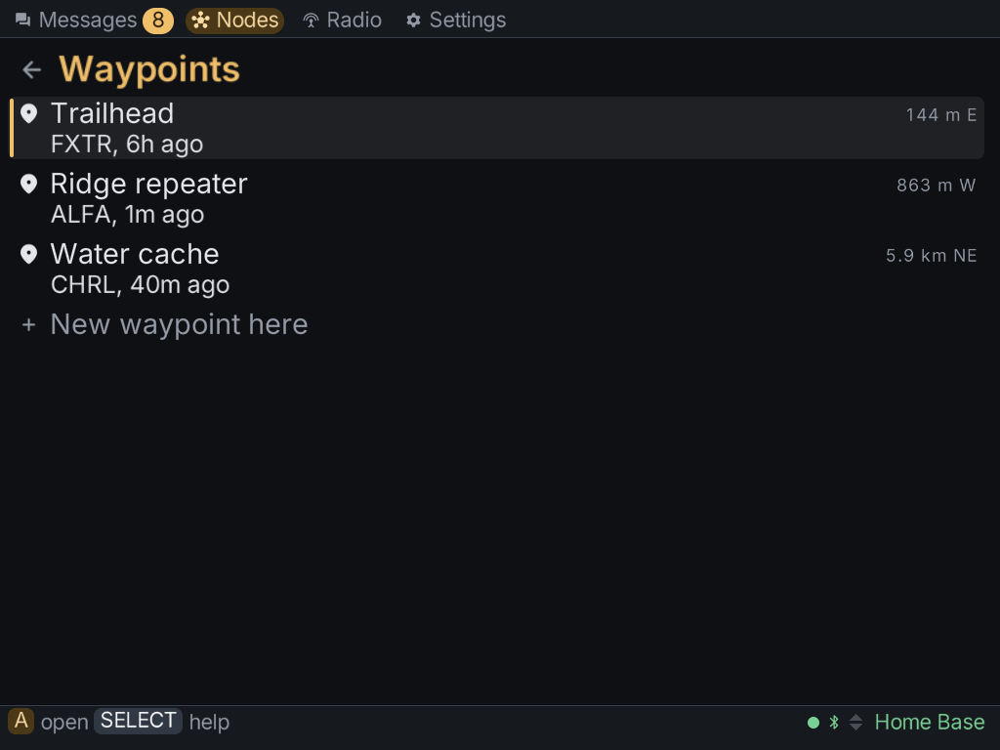

The **Map** tab shows every node and shared place that has reported a position. It has two
views: the map, and a list of places. **R2** turns to the places and **L2** turns back.

## Moving around the map

| Button | What it does |
|---|---|
| **d-pad** | pan; a direction stops on the next marker that way |
| **Y / X** | zoom out / in |
| **START** | fit everything on screen |
| **A** | open whatever is nearest the crosshair in the middle |

To pick a marker, pan until it sits under the crosshair. A node opens its details. A place
opens in the list of places.

:::note
A marker shows where a node last said it was, not where it is now. Many radios round their
position on purpose, and the ring around a marker shows how far out it might be.
:::

## Places (waypoints)

A place is a waypoint someone shared on the mesh, such as a meeting point, a camp or a car
park. The list shows each one's distance and bearing from you, which needs your radio to have a
position of its own.

- **New waypoint here**, at the top of the list, marks your radio's current position as a new
  place and shares it.
- Open a place to see who shared it, when, and when it expires.
- **Share it again** sends it out once more.
- **Delete from the mesh** removes the place for everyone. Press **A** twice.
- **Forget it here** removes it from this client only.

From a node's details, **Save this place** turns that node's position into a place.

## Map tiles

Without map tiles, the map draws markers over a grid with a scale bar. To see streets and
terrain underneath, download tiles from **Settings → Maps**:

1. Connect the Brick to Wi-Fi.
2. Open **Settings → Maps** and choose **See the maps to download**.
3. Pick the world map, a region, or both. The world map sits under every region, so you can
   keep a detailed region and a lighter world map together.

Downloads go in pieces and resume where they left off. You can delete a map from the same
screen.

:::caution
On the Brick, Wi-Fi and Bluetooth share an antenna. While a map downloads, a Bluetooth radio
disconnects, and it reconnects when the download ends. A radio on USB stays connected.
:::

Maps are kept in `~/.meshclient/maps/`, outside the pak, so an update never removes them.
