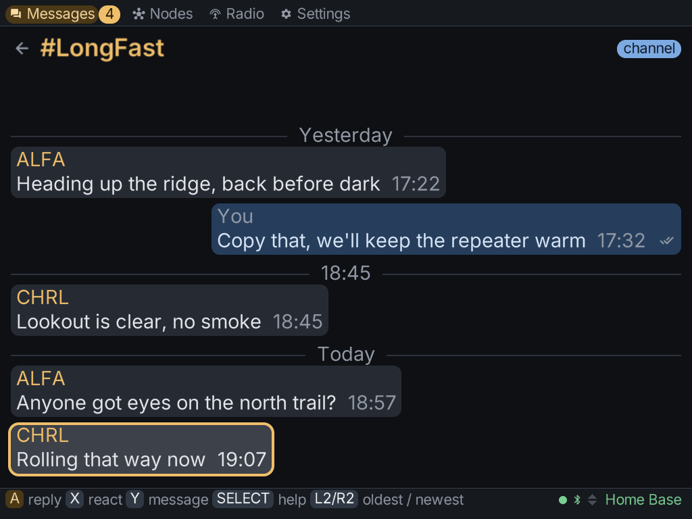

The **Messages** tab has two levels: a list of conversations, and the conversation you open.

## The conversation list

- **All traffic**: every message from every channel and node, in one transcript.
- **Each channel** on your radio, such as the primary channel and any secondary channels.
- **Each node** you have direct messages with.
- **New message**, where you pick a channel or a node to write to.

## Reading a conversation

Open a conversation with **A**. Inside it:

- **A** replies to the message under the cursor.
- **X** reacts to it with an emoji.
- **Y** writes a new message to the conversation.
- **START** resends one of your messages that failed. The failed message stays where it is,
  and the retry goes out as a new message.

A direct message you send shows its state: **sending**, then **delivered** once the other
radio acknowledges it, or **failed**.

:::note
The mesh never acknowledges a channel message, so a channel message shows no delivery mark at
all. The client won't claim a delivery it never heard about.
:::

Messages are kept on the SD card, one file per conversation. A conversation can go back further
than what the radio itself holds, and it survives a restart.

## Writing a message

Press **Y** to open the compose sheet. It sits on top of the conversation, so it always knows
who the message is for. It has:

- **the draft**: press **A** to type with the [keyboard](../controls/#the-keyboard), and
  **START** to send;
- **quick replies**, one row down: canned messages you can send with one press.

### Your own quick replies

In the compose sheet, press **X** on the draft row to keep the current draft as a quick reply.
You can keep up to 16 replies, each up to 63 bytes.

Quick replies are saved to `canned.txt` in the client's data folder (`~/.meshclient/`). You can
also edit that file directly, one reply per line.

## Deleting a conversation

On the conversation list, press **X** once to arm the delete and again to confirm. The
messages are removed from this client: from its memory and from the file on the card. Nothing
is deleted from the radio, because the radio keeps no history of its own for the client.

- Deleting a **channel** conversation empties it, but the channel stays in the list.
- Deleting a **direct** conversation removes it from the list.
