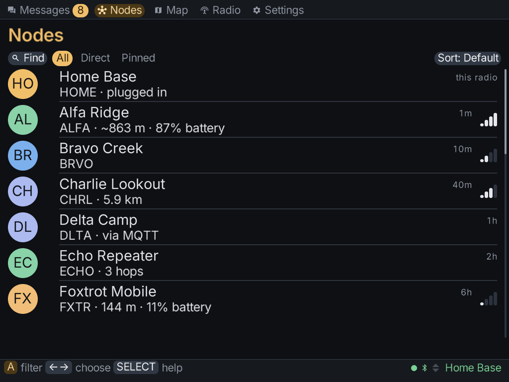

The **Nodes** tab lists every node your radio has heard. It's the mesh's contact list.

The list outlives the connection. When your radio disconnects, the nodes stay listed, and a
reset of the radio's node database doesn't clear them either. To clear them, see
[Node lists](../radio/#node-lists).

## Finding a node

A row of chips sits above the list. **Left / Right** move between them and **A** presses one.

| Chip | What it does |
|---|---|
| **Find** | type part of a name, short name or `!id`; the list keeps only matching nodes. **X** clears it |
| **All** | every node |
| **Direct** | nodes your radio hears directly, in earshot |
| **Pinned** | only the nodes you pinned |
| **Sort** | choose an order: default, recent, name, distance or hops |

To pin a node so it stays at the top, press **X** on it in the list.

## A node's details

Press **A** on a node to open its details. A row only appears when the node has actually
reported that information. A node that has never sent its position has no distance row, for
example.

The details can include the node's name and ID, when it was last heard, its signal, how many
hops away it is, its position, battery and telemetry, and whether its key is verified.

## What you can do with a node

The node's actions include:

- **Message this node**, to start a direct conversation.
- **Ask for its name**, **Ask where it is** or **Ask for telemetry**, to get fresh information.
- **Trace route**, to see the path your messages take to it.
- **Show on map**, if it has a position.
- **Pinned to top**, **Mute this node** or **Ignore this node**.
- **Remove from radio**, pressed twice, to remove it from the radio's node database.
- **Verify this key**. See [Verifying a key](#verifying-a-key).
- **Configure by radio**, to change the node's settings over the mesh. This only works for a
  node that has given your radio admin access.

Some actions only appear for MeshCore radios, such as logging in to a repeater. See
[MeshCore radios](../meshcore/).

## Verifying a key

Direct messages on Meshtastic are encrypted with each radio's key. Verifying a key proves the
node you're messaging is the person you think it is, not someone else using their name.

You do the check together, out loud, never over the mesh:

1. Choose **Verify this key** on the node.
2. One of you is shown six digits. Read them to the other person, who types them in.
3. You are both shown a short code. Compare them. Answer **They match** only if every
   character matches.
4. Choose **Mark it verified**.

A verified node shows **verified in person** and a padlock.
