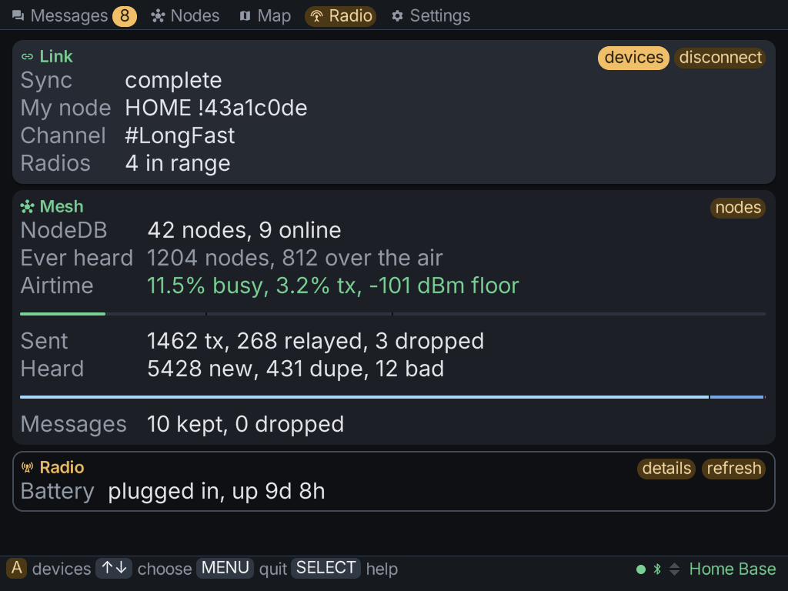

The **Radio** tab is the dashboard for the radio you're holding. It opens on three cards, and
each card has a button that leads to a page.

| Card | About | Its button opens |
|---|---|---|
| **Link** | the connection between the client and the radio | **devices**, the [device list](../connecting/) |
| **Mesh** | the mesh the radio can hear | **nodes**, the node lists |
| **Radio** | the radio itself | **details**, the radio's details and actions |

A fourth card, **Broker**, appears only when the radio has asked the client to relay MQTT for
it. See [MQTT](../mqtt/).

## Node lists

There are two lists of nodes. The radio keeps a short one that trims itself. This client keeps a
longer one, which is why the Nodes tab can show nodes the radio has already dropped.

From the Mesh card's **nodes** button:

- **Reset node database** empties the radio's own list.
- **Forget off-radio** clears the nodes only this client remembers.
- **Forget all cached** clears this client's whole list.

Each forget row shows how many nodes it would clear. The forget rows don't touch the radio.

## The radio's details

The Radio card's **details** button shows what the radio says about itself, and holds the
actions you can take on it.

### Firmware

The details page checks whether a newer firmware release exists for your radio's board, and can
install it:

- **ESP32 radios** (Heltec V3, T-Beam and similar) install over Bluetooth. On Windows the
  radio has to be set to No PIN first, because Windows can't pair with a PIN-protected radio
  yet.
- **nRF52 radios** (RAK4631, T-Echo, T114 and similar) install over Bluetooth on the Brick,
  or over USB. On a Mac they install over USB only. Windows can't install them yet, so use
  the [Meshtastic web flasher](https://flasher.meshtastic.org) there.

MeshClient saves a [backup](../settings/#backups) of the radio's settings before it installs
firmware.

:::tip[An install stopped part-way?]
That doesn't leave a broken radio. The radio waits in its bootloader, and running the same
install again picks up from there.
:::

### Maintenance

- **Reboot** and **Shutdown**.
- **Back up to flash** and **Restore from flash**: the radio's own copy of its settings, kept
  on the radio.
- **Save settings to card**: a copy kept on the Brick. See [Backups](../settings/#backups).
- **Factory reset**: **Config** resets the radio's settings, and **Everything** resets the
  whole radio. The confirm screen spells out what each one clears.

## While configuring another node

When [Settings](../settings/) is pointed at another node over the mesh, the Radio tab stays
about the radio in your hand and offers a way back.
