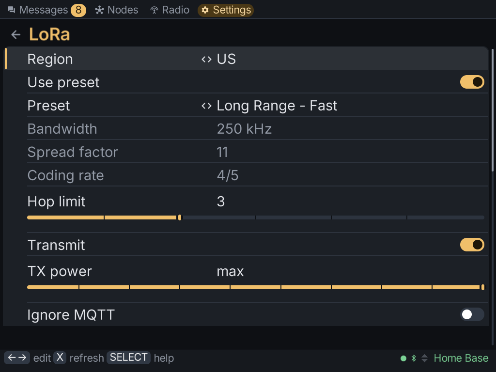

The **Settings** tab reads your radio's configuration and lets you change it in place: the
same settings the Meshtastic phone app offers, with no phone needed.

## How a change works

1. Open a section, such as **LoRa** or **User**.
2. Move to a row and press **A** to change it. A list steps through its choices, and text
   opens the keyboard.
3. Press **Y** to save the section. The client sends the changes to the radio.
4. The radio usually reboots to apply the change. The link drops and comes back on its own.

:::note
A reboot after a save is normal, not a crash. The radio has to restart to apply most
settings.
:::

Press **SELECT** in any section for help with it. Help opens at the row your cursor is on and
explains what each setting does, and what goes wrong if it's set badly.

Press **X** to read the section from the radio again.

## The sections

| Section | What's in it |
|---|---|
| **User** | your long and short name, licensed operator mode, and your [contact code](../sharing/#sharing-your-contact) |
| **LoRa** | region, modem preset, hop limit and transmit power |
| **Channels** | your channels, their names and keys, and [sharing them](../sharing/) |
| **Position** | GPS, fixed position and how often position is shared |
| **Device**, **Display**, **Power**, **Bluetooth**, **Network**, **Security** | the rest of the radio's configuration |
| **Modules** | MQTT, telemetry, store & forward, range test, neighbour info and the other modules |
| **About radio** | the radio's model, firmware and IDs |
| **Radio actions** | reboot, shutdown and the resets, also on the [Radio tab](../radio/#maintenance) |
| **Maps** | [map tiles](../map/#map-tiles) to download |
| **Backups** | copies of each radio's settings on the card |
| **Profiles** | settings to put on another radio |
| **About MeshClient** | the client itself: version, updates, theme, language, text size |

## Configuring another node

On a node's details, **Configure by radio** points Settings at that node over the mesh.
Changes go to that node instead of yours, and **About radio** and **Radio actions** show for
that node. The node has to have given your radio admin access first.

## Backups

The client keeps copies of each radio's settings on the card. It takes one automatically:

- the **first time** it connects to a radio;
- **before every change** you save;
- **before a firmware install**.

You can also take one yourself. Opening a backup compares it with the radio, showing the
backup's value and then the radio's for each setting that differs.

## Profiles

A profile is a set of settings you can put on any radio running the same firmware. Make one
from a backup, or read one from a Meshtastic `.cfg` file. A profile never contains a radio's
name, position, keys or contacts, so it's safe to put on several radios.

## About MeshClient

**About MeshClient** works with no radio connected. It has:

- the **version**, and [**Check for updates**](../install/#updating);
- **Theme**: dark, light, high contrast or colour-blind friendly;
- **Language**: English or Spanish. The change applies immediately;
- **Text size**, to make everything larger or smaller;
- **Crash report**, which appears only if the client stopped unexpectedly. **Send report**
  sends the error and where in the client it happened, never the log or your messages.
  **Discard report** throws it away.
